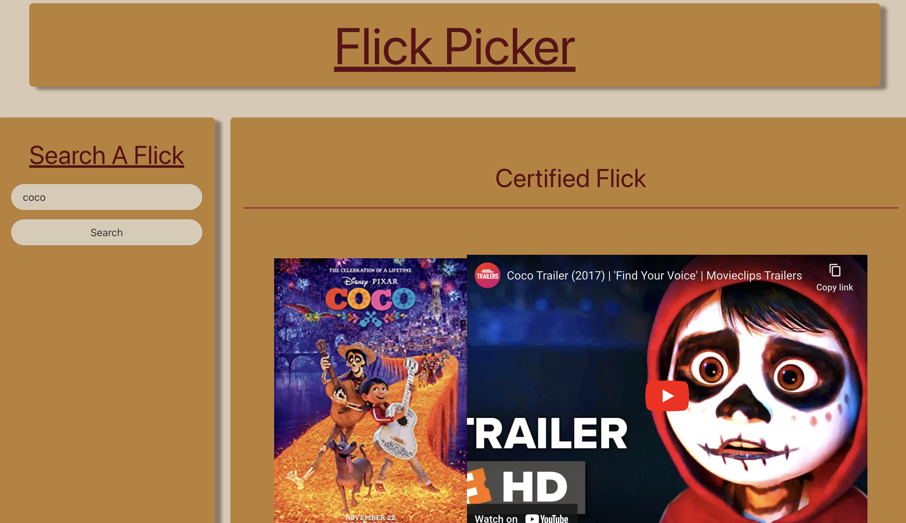
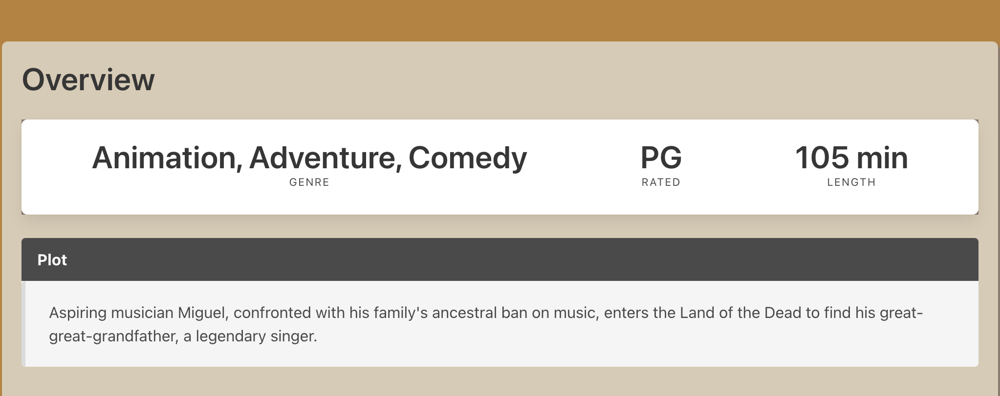
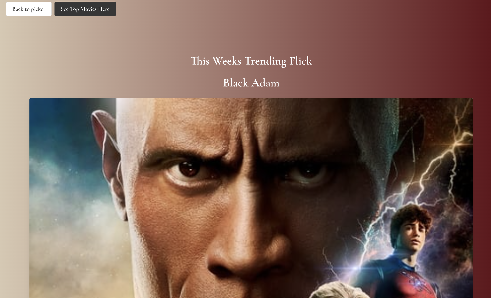
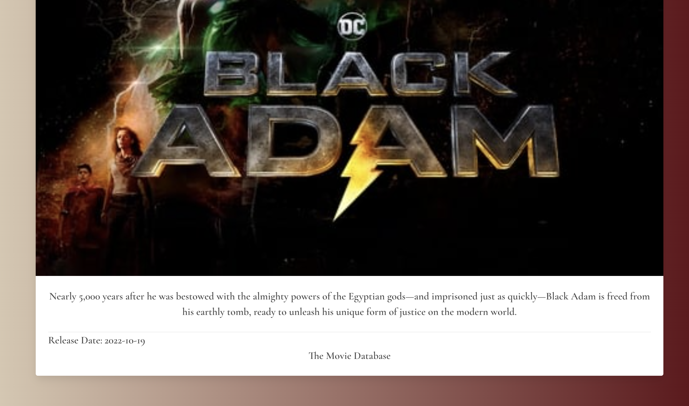

# Flick Picker 🎥

The movie review site you've been losing sleep over.

## Installation 📲

n/a

## Tools 🛠

- HTML/CSS

- [Bulma](https://bulma.io/)

- JavaScript

- [OMDB API](https://www.omdbapi.com/) - used to grab movie poster and ratings

- [Youtube API](https://developers.google.com/youtube/v3) - used to grab youtube videoID

- [TMDB](https://developers.themoviedb.org/3/getting-started/introduction)

- [Google Fonts](https://fonts.google.com/)

## About 📝

Have you ever found yourself spending more tiime researching a movie than you would have spent watching the movie itself?

If this applies to you (and even if it doesnt) then look no further!

Flick picker is an easy-to-use webpage that allows users to quickly find ratings from: Rotten Tomatoes, Metacritic, and Internet Movie Database for that film. Not satisfied with critic rating? No problem! When you search for a film you will also be presented with the trailer, a summary of the plot, as well as the ratings. So you can spend more time popping popcorn, than researching a flick!

## How to use 💡

- Visit link below
- Search movie title

That's it! Sheeesh

## User Story

AS a user,
I WANT to be able to see information from multiple sites on a specific movie that I have searched, all compiled onto one webpage
SO THAT I can easily decide if it is a movie worth watching.

## Motivation 🔍

We love films, flicks, and movies alike. What we didn't love was scouring the internet for reliable and quick movie reviews.

## Why? ❓

Why Not?

## Acceptance Criteria

WHEN I type in a movie title into the search bar
THEN the search button should be able to be clicked, triggering the search to begin.
WHEN the correct movie has been found
THEN the movie title, poster, trailer, plot, ratings, and our personal suggestion will display.
WHEN I click on the trailer thumbnail
THEN it will give me the option to go to Youtube, or to make the video full screen in the web-page.
WHEN I search a new movie
THEN the previous searched movies will be displayed with clickable posters under the searchbar, up to 3 movies.

## Screenshots 📸

## Link ⛓

[Deployed Link](https://loquacious-florentine-c87ce2.netlify.app)
